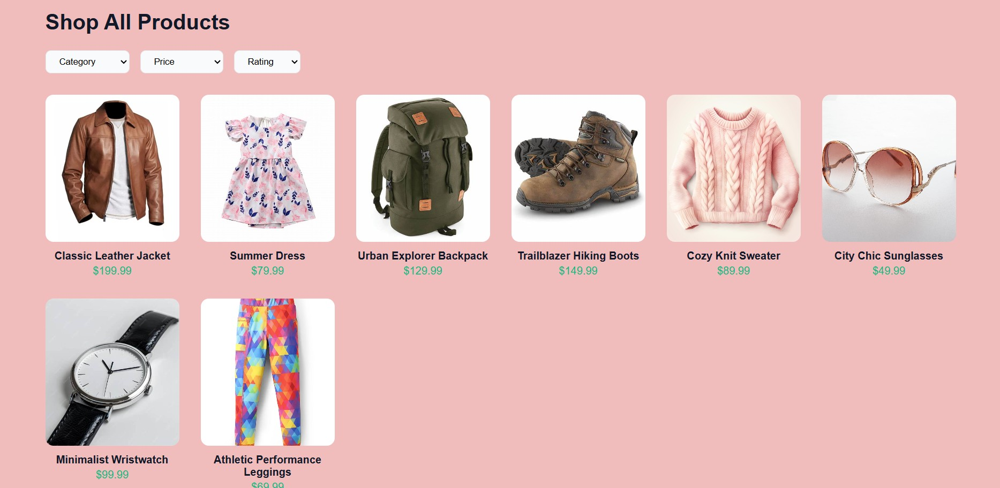

# 🛍️ Learning project

A responsive product listing interface that mimics a basic e-commerce layout. This project demonstrates how to implement dynamic product filtering, sorting, and searching using core web technologies — all in the browser without any page reloads.

# 🌐 Live Demo
https://himanshu4812.github.io/FashionHub/


## 🔍 Features
- 🔎 Search products by name
- 🧩 Filter by category (`Men`, `Women`, `Accessories`)
- 💲 Sort by price (`Low to High`, `High to Low`)
- ⭐ Sort by rating (`Highest`, `Lowest`)
- 📱 Fully responsive UI (mobile-friendly)
- ⚡ Real-time updates using JavaScript and DOM manipulation

## 🛠️ Technologies Used

- **HTML5** – for structure
- **CSS3** – Flexbox, Grid, and responsive design
- **JavaScript** – DOM manipulation, array methods (`filter()`, `sort()`), event listeners

## 📁 Folder Structure
```
📦 project-root/
├── index.html
├── style.css
├── script.js
└── img/
    ├── jacket.webp
    ├── boots.jpg
    ├── watch.jpg
    └── ... (other product images)
```


## 📸 Preview


# 🚀 Getting Started

## To run the project locally:

1. Clone this repository:
   ```bash
   git clone https://github.com/your-username/responsive-product-catalog-ui.git
   
2. Navigate to the project directory:
cd responsive-product-catalog-ui

3. Open index.html in your browser (or use Live Server in VS Code).

## 💡 Ideal For
This project is perfect for beginners learning:
- DOM Manipulation
- Responsive Web Design
- Practical JavaScript with UI logic

# 📬 Contact
Feel free to reach out for collaboration or suggestions:

- [GitHub](https://github.com/Himanshu4812)
- [LinkedIn](https://www.linkedin.com/in/himanshu-kumar-389a85273/)

